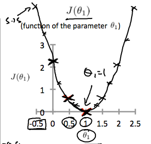
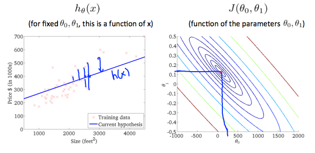

# Model Representation

Notations:
* m = Number of training examples
* x's = "input" variable/features
* y's = "output" variable/"target" variable
* (x,y) = one training example
* (xi, yi) = ith training example

Training Set -> Learning Algorithm -> Hypothesis

Size of house (x) -> Hypothesis -> Estimated price (estimated value of y)

Hypothesis maps from x's to y's.

### How do we represent _h_?
Hypothesis: hΘ(x) = Θ0 + Θ1x

Shorthand for hΘ(x): h(x)

Therefore, h(x) = Θ0 + Θ1x

This model is called **linear regression with one variable** (which is x). Another name is **univeriate linear regression**. Univeriate is a fancy way of saying "one variable".

# Cost Function
This will help us figure out how to fit the best possible straight line to our data.

Θi's are the _parameters_ of the model.

### How to choose Θi's?

Review of linear regression: Different parameters will yield different results: 

Idea: Choose Θ0, Θ1 so that hΘ(x) is close to y for our training examples. This is done on our training data set where we have both x and y.

**Just remember**: We want hΘ(x) - y to be small as it is the difference between our estimation (hΘ(x)) and our actual (y) outputs. 

The instructor then adds (hΘ(x) - y)2 which makes the minimization become "minimize the _square_ difference between estimated and actual".

Remember that we are using this: (xi, yi) = ith training example.

With that said, we want to "sum" over our training set which looks like this:

Don't forget that, 
hΘ(xi) = Θ0 + Θ1xi

The "minimize Θ0 Θ1" translates to "find me the values of Θ0 and Θ1 that causes hΘ(xi) = Θ0 + Θ1xi to be **minimized**".

### Formal definition of cost function:

This is also called the _squared error cost function_ because we are evaluating error costs by squaring the differences of expected and actual. There are other cost functions that can be used too.

# Cost Function - Intuition I

Quick recap!

**Hypothesis:**

hΘ(x) = Θ0 + Θ1x

**Parameters:**

Θ0, Θ1

**Cost Function:**

**Goal:**

Minimize J(Θ0, Θ1)

**We will use a Simplified Hypothesis!**

hΘ(x) = Θ1x

This is basically setting  Θ0 = 0. 

Using this simplified hypothesis, we are choosing only hypothesis functions that pass through the origin (0,0). 

From here, I did the calculations on paper but you can see the overview of the notes [here](https://www.coursera.org/learn/machine-learning/supplement/u3qF5/cost-function-intuition-i) but here is what I got out of it: 

Essentially for different values of Θ1 you can plot J(Θ1) which is our cost function. When you plot this you'll begin too see something like this:

Since the cost function is to minimize J(Θ1) you want to find the value of Θ1 that yields the smallest ouput from J(Θ1). In this example, J(1) = 0 which is the best minimized output as you can clearly see in the graph above.

# Cost Function - Intuition II

This video section was showing how having two parameters affects what we did in the last section, where we used only one parameter.

What we see here is the use of a contour plot to visualize where the best values of Θ0, Θ1 are at, in order to minimize J(Θ0, Θ1).

Here is an example where the values are very close to the minimum:

